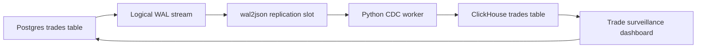

# Trade Surveillance CDC Demo

A local, reproducible Change Data Capture demo for a finance operations use case. Postgres acts as the trade booking system, a Python worker reads logical replication events through `wal2json`, and ClickHouse serves the analytical replica used by the dashboard.

No hosted deployment is included.

## Use Case

The demo models institutional trade surveillance. Users can add a new trade, flag a risky trade, approve a reviewed trade, correct a trade price, cancel a duplicate, or delete an erroneous booking. Selecting an action previews the mapped SQL without mutating data. Clicking `Run selected SQL` writes to Postgres, then CDC carries the change into ClickHouse.

## Architecture



## Reproducible Run

Create a virtual environment and install dependencies:

```bash
python -m venv .venv
source .venv/bin/activate
pip install -r requirements.txt
```

Start Postgres and ClickHouse:

```bash
scripts/start_databases.sh
```

In a second terminal, load the deterministic finance dataset:

```bash
python scripts/setup_databases.py
python scripts/ingest_finance_data.py
```

In a third terminal, start the CDC worker:

```bash
scripts/run_cdc_worker.sh
```

In a fourth terminal, open the dashboard:

```bash
scripts/run_dashboard.sh
```

The dashboard normally opens at `http://localhost:8501`.

## What To Click

The dashboard includes 6 scenario buttons:

| Scenario | What it demonstrates |
| --- | --- |
| Add JPM trade | Inserts a new equity booking. |
| Flag NVDA risk | Updates one trade into review and raises risk score. |
| Approve US10Y review | Clears a reviewed rates trade. |
| Correct MSFT price | Applies a small price and notional correction. |
| Cancel SOFR duplicate | Cancels a duplicate trade while preserving history. |
| Delete bad credit booking | Deletes an erroneous trade and emits a CDC tombstone. |

Click a scenario to preview SQL. Then click `Run selected SQL` to execute it against Postgres. The dashboard embeds live read-only query panes for Postgres and ClickHouse so the source and destination states are visible side by side. KPIs, charts, and the CDC event feed refresh automatically after the worker applies the change.

## Project Structure

```text
cdc-artie-demo/
|-- clickhouse/
|   `-- init.sql                 # ClickHouse trades table
|-- data/
|   `-- trades_seed.csv          # Versioned deterministic dataset
|-- docs/
|   |-- architecture.mmd         # Mermaid architecture diagram
|   `-- blog-draft.md            # Blog outline and draft
|-- postgres/
|   |-- Dockerfile               # Postgres with wal2json installed
|   `-- init.sql                 # Postgres trades table
|-- scripts/
|   |-- ingest_finance_data.py   # Deterministic baseline loader
|   |-- reset_demo.py            # Same baseline reload entry point
|   |-- run_cdc_worker.sh        # Starts the worker
|   |-- run_dashboard.sh         # Starts Streamlit
|   |-- setup_clickhouse.py      # Ensures ClickHouse schema
|   |-- setup_databases.py       # Ensures both schemas
|   |-- setup_postgres.py        # Ensures Postgres schema
|   `-- start_databases.sh       # Starts Docker Compose
|-- screenshots/
|   `-- .gitkeep                 # Place dashboard screenshots here
|-- .env.example                 # Local environment reference
|-- docker-compose.yml           # Local Postgres and ClickHouse stack
|-- cdc_pipeline.py              # CDC worker
|-- dashboard.py                 # Streamlit control-room dashboard
|-- finance_actions.py           # Mapped SQL demo actions
`-- requirements.txt             # Python dependencies
```

## Data Model

The reproducible baseline lives in `data/trades_seed.csv`. The source table is `trades`. It includes:

- Trade identity and timestamps: `trade_id`, `trade_ts`, `updated_at`
- Client and ownership fields: `account_id`, `client_name`, `desk`, `trader`
- Instrument fields: `symbol`, `asset_class`, `side`, `venue`
- Economic fields: `quantity`, `price`, `notional_usd`
- Control fields: `risk_score`, `status`

ClickHouse stores the same trade fields plus CDC metadata:

- `__cdc_operation`
- `__cdc_is_deleted`
- `__cdc_updated_at`

The ClickHouse table uses `ReplacingMergeTree(__cdc_updated_at)` with `ORDER BY trade_id`. Dashboard queries use `FINAL` and filter `__cdc_is_deleted = 0` for the live analytical state.

## Dashboard Accuracy

The dashboard computes KPIs from the ClickHouse replica so changes appear only after CDC applies them:

- Source trades
- Replica trades
- Open notional
- Exceptions
- High-risk trades
- Average risk score
- Notional by desk
- Trade status distribution
- Recent CDC events
- Exception queue

The source and replica tabs are shown side by side in the same interface so row-level CDC behavior is easy to verify.

## Environment

The app works with built-in local defaults. Copy `.env.example` to `.env` only if you want to override ports, connection strings, or local demo credentials.

`.env`, local event logs, Python caches, and generated dependency folders are ignored by Git.

## Resetting The Demo

Reload the deterministic baseline:

```bash
python scripts/ingest_finance_data.py
```

For a full container reset:

```bash
docker compose down
docker compose up
python scripts/ingest_finance_data.py
```

## Screenshots

Put blog screenshots in `screenshots/`. Recommended captures:

- Dashboard immediately after baseline load and worker backfill.
- SQL panel after a scenario click.
- Notional by desk and exception queue after several changes.
- CDC event feed after insert, update, and delete examples.
