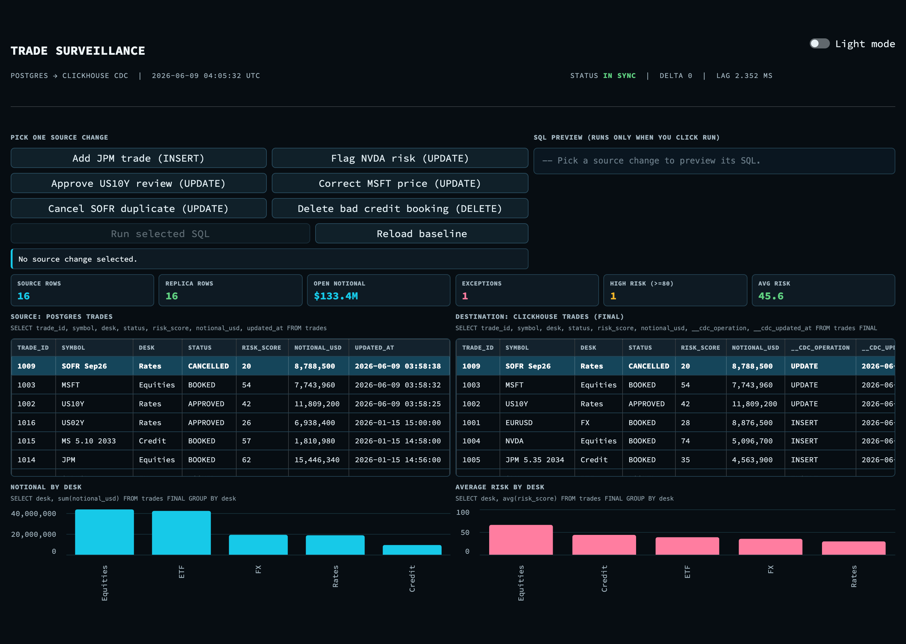
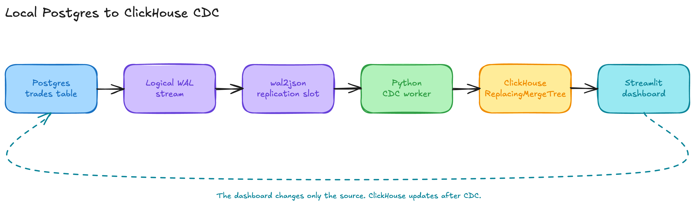
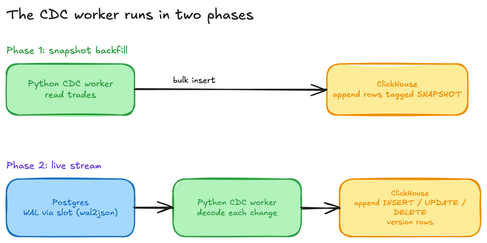
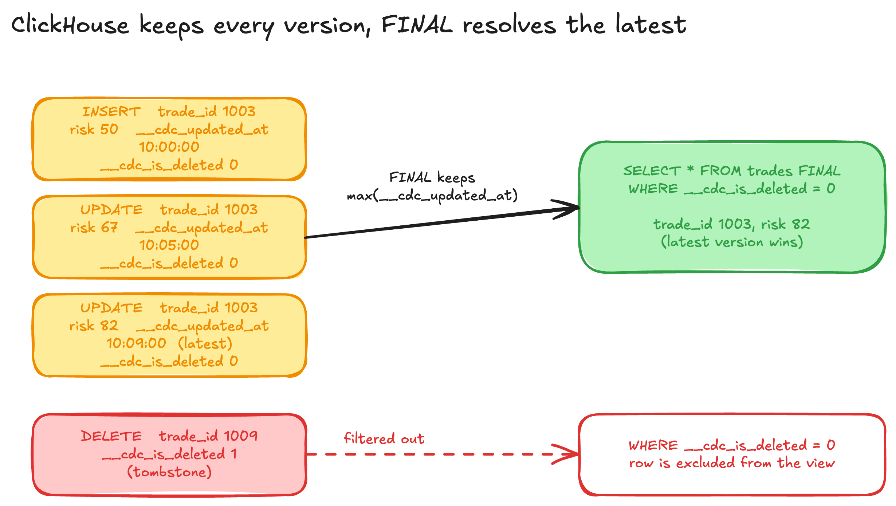
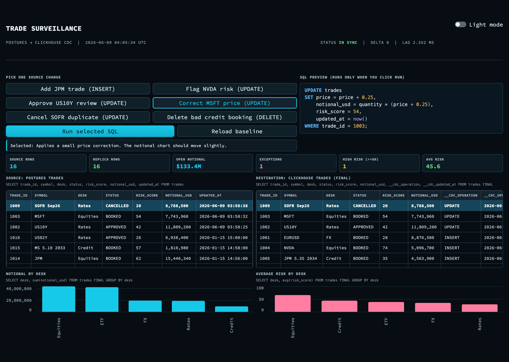
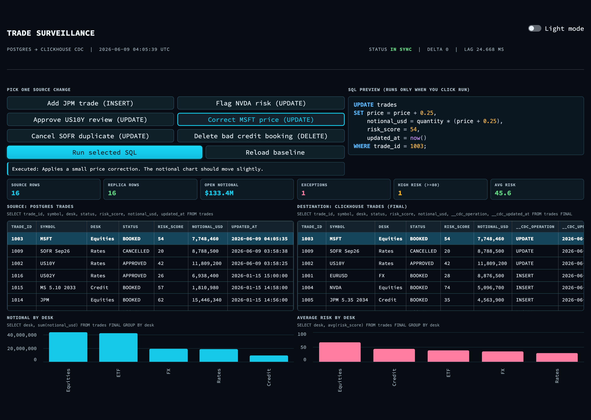
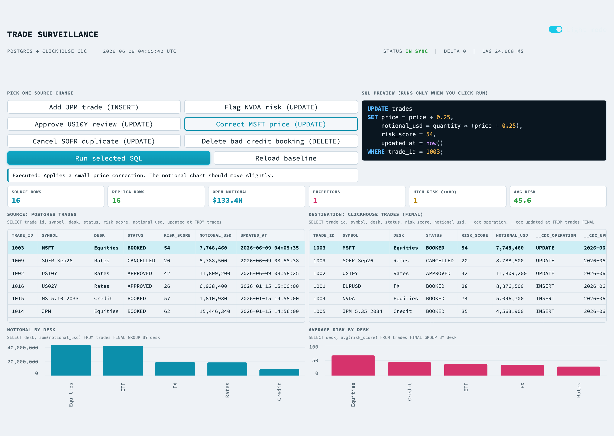
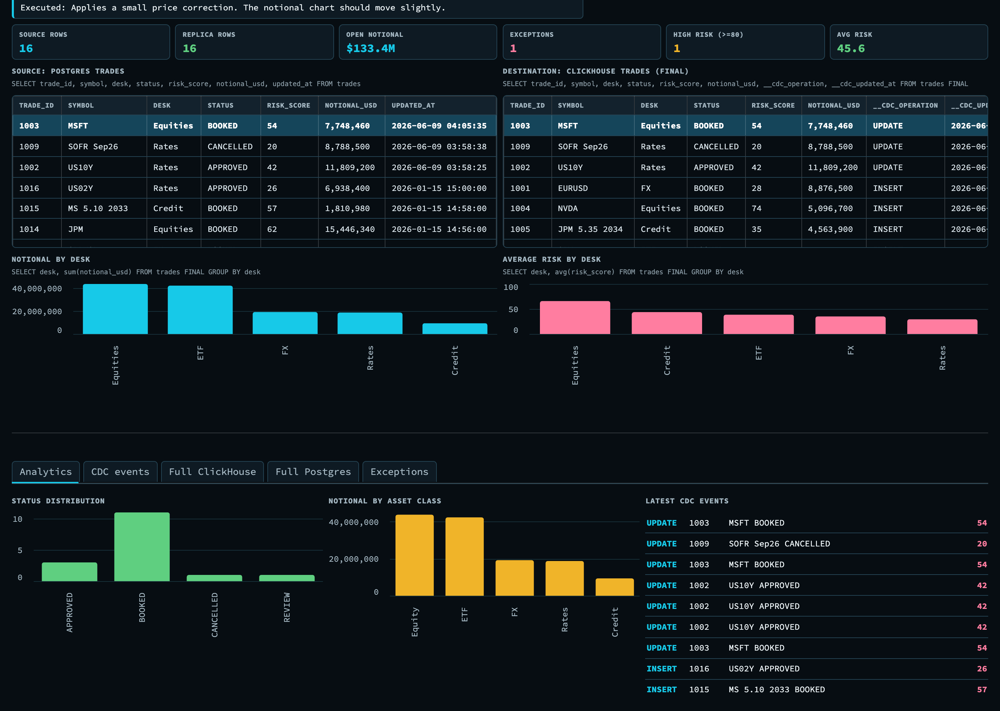

# From trade booking to analytics in seconds: a local Postgres to ClickHouse CDC demo

A serious change data capture (CDC) demo does not need hosted infrastructure. A local stack can still show the core production pattern: trades are booked in Postgres, streamed off the write ahead log, materialized into ClickHouse, and watched through a control room dashboard. This post walks through a small but complete version of that pipeline, built for a trade surveillance use case, and explains how each piece works.

Everything here runs on one machine with Docker, Python, and Streamlit. The data is deterministic, so anyone can reproduce the same result.



## Why low latency replication matters in finance operations

Trading systems book orders into a transactional database that is tuned for correctness and concurrency, not for analytics. Postgres is a common choice for that system of record. The moment a trade is booked, several other teams want to see it: risk wants the updated exposure, surveillance wants to scan for suspicious patterns, and operations wants to confirm the booking settled cleanly.

Running those analytical queries directly against the trading database is a bad idea. The scans compete with live booking traffic, and the row oriented storage is slow for the wide aggregations that surveillance needs. The standard answer is to replicate the data into an analytical store such as ClickHouse, and to keep that copy fresh with CDC instead of slow batch exports. The faster the replication, the sooner an analyst can act on a flagged trade.

## The use case: trade surveillance

The demo models a surveillance control room. The source of truth is a `trades` table that holds institutional orders across equities, rates, credit, FX, and ETFs. Each trade carries operational fields that a surveillance team actually looks at:

- desk, trader, client, and venue
- symbol, asset class, and side
- quantity, price, and notional in USD
- a risk score from 0 to 100
- a status: BOOKED, REVIEW, APPROVED, BLOCKED, or CANCELLED

The dashboard then tracks the things a reviewer cares about: how many rows exist on each side, total open notional, the count of exceptions in REVIEW or BLOCKED, the number of high risk trades, and the average risk score. It also shows notional by desk and average risk by desk, so a spike is easy to spot.

## The architecture

The flow is a straight line from the source table to the dashboard, with one important loop: the dashboard only ever writes to Postgres. It never writes to ClickHouse.



The pieces:

1. **Postgres** holds the `trades` table and emits logical replication events.
2. **Logical WAL with wal2json** turns each committed change into a JSON record.
3. **A Python CDC worker** reads that stream and writes version rows into ClickHouse.
4. **ClickHouse** stores every version and resolves the latest state at query time.
5. **A Streamlit dashboard** reads from both stores and drives changes into Postgres only.

## How the CDC actually works

### Postgres side

The source table is ordinary, with one extra setting:

```sql
ALTER TABLE trades REPLICA IDENTITY FULL;
```

`REPLICA IDENTITY FULL` makes Postgres include the full previous row image in update and delete events, not just the primary key. That matters for a faithful replica, because the worker can apply deletes and updates with complete context.

The worker creates a logical replication slot that uses the `wal2json` output plugin:

```python
cur.create_replication_slot(SLOT_NAME, output_plugin="wal2json")
```

A replication slot is Postgres remembering a reader position in the write ahead log. As long as the slot exists, Postgres retains the WAL the worker has not consumed yet, so no change is lost if the worker restarts.

### The worker

The worker runs in two phases.



First it does a **snapshot backfill**: it reads the current `trades` table and inserts each row into ClickHouse tagged with the operation `SNAPSHOT`. This gives ClickHouse a complete starting state.

Then it **streams**: it starts logical replication on the slot and decodes each `wal2json` message. For every insert, update, or delete it appends a new version row to ClickHouse, never updating in place. Each version carries three bookkeeping columns:

- `__cdc_operation`: SNAPSHOT, INSERT, UPDATE, or DELETE
- `__cdc_is_deleted`: 0 for live rows, 1 for tombstones
- `__cdc_updated_at`: the version timestamp used to pick the winner

The worker also appends every event to a local `cdc_events.jsonl` log with a measured `lag_ms`, which is what the dashboard uses for the latest events panel and the lag readout.

### ClickHouse side

ClickHouse never mutates rows in place either. The table uses the `ReplacingMergeTree` engine:

```sql
CREATE TABLE default.trades (
  ...
  __cdc_operation String,
  __cdc_is_deleted UInt8,
  __cdc_updated_at DateTime64(6, 'UTC')
)
ENGINE = ReplacingMergeTree(__cdc_updated_at)
ORDER BY trade_id;
```

`ReplacingMergeTree(__cdc_updated_at)` means: for rows that share the same sort key (`trade_id`), keep only the one with the highest `__cdc_updated_at`. Background merges eventually collapse old versions, and a query can force that collapse immediately with the `FINAL` keyword. Deletes are handled as tombstones, so the read query filters them out:

```sql
SELECT *
FROM trades FINAL
WHERE __cdc_is_deleted = 0
ORDER BY trade_id;
```

This append plus `ReplacingMergeTree` plus `FINAL` pattern is how you get update and delete semantics on a store that is built for high speed appends.



## The dashboard, end to end

The dashboard is the demo surface. It is intentionally compact so the whole story fits on one screen.

You pick one source change, preview its SQL, and only then run it. The SQL preview is read only until you click Run, which keeps the demo honest: nothing touches the database until you ask.



The two panes below are live read only `SELECT` results from each store, shown side by side. They are not a database console. The captions under each pane show the exact query, which makes the point that the dashboard reads ClickHouse rather than editing it.

When you run a change, you watch it travel. The screenshot below was taken right after running the MSFT price correction. The same `trade_id` is highlighted on both sides, and the destination pane shows `__cdc_operation = UPDATE`, which means the worker read the Postgres change and appended a new version that `FINAL` resolved to the latest state. The KPIs and the desk charts move at the same time.



The whole UI also has a light mode, for screen sharing in a bright room.



A second tab keeps the supporting detail close: status distribution, notional by asset class, and the most recent CDC events with their operation and risk.



## The demo scenarios

Every button maps to one SQL statement against Postgres, chosen so that at least one KPI or chart visibly moves once CDC applies it:

- **Add JPM trade (INSERT)**: a new equity booking appears in both tables.
- **Flag NVDA risk (UPDATE)**: raises the risk score and moves the trade to REVIEW, so the exception count and the risk chart change.
- **Approve US10Y review (UPDATE)**: clears a review item, so the exception count drops.
- **Correct MSFT price (UPDATE)**: a small price correction that nudges notional.
- **Cancel SOFR duplicate (UPDATE)**: cancels a duplicate booking.
- **Delete bad credit booking (DELETE)**: removes an erroneous trade, which arrives in ClickHouse as a tombstone and disappears from the FINAL view.

Because the dataset is deterministic, a Reload baseline button resets both stores to the same starting point, so the demo is repeatable.

## What a production version would add

This is a local project, not a platform. The local design keeps the moving parts visible, which is the point. A production build would add the things that a single machine demo can skip:

- schema governance and compatibility checks as the source table evolves
- retries, backpressure, and dead letter handling in the worker
- replay controls and slot monitoring so a stuck consumer is caught early
- access controls on both stores and on the dashboard
- lineage and alerting so an analyst trusts what the numbers mean
- operational runbooks for failover and reseeding

None of that changes the core mechanic shown here. It hardens it.

## Run it yourself

```bash
scripts/start_databases.sh
python scripts/ingest_finance_data.py
python cdc_pipeline.py
streamlit run dashboard.py
```

The dashboard runs at `http://localhost:8501`. Pick a source change, preview the SQL, run it, and watch the change land in ClickHouse.

## Closing

The takeaway is simple. You can demonstrate the real CDC pattern, write side correctness and read side freshness, with nothing more than Postgres, a logical replication slot, a small Python worker, and ClickHouse. Once you can see a single trade move from the source commit to the analytical view in seconds, the production version is mostly a matter of hardening, not new ideas.
